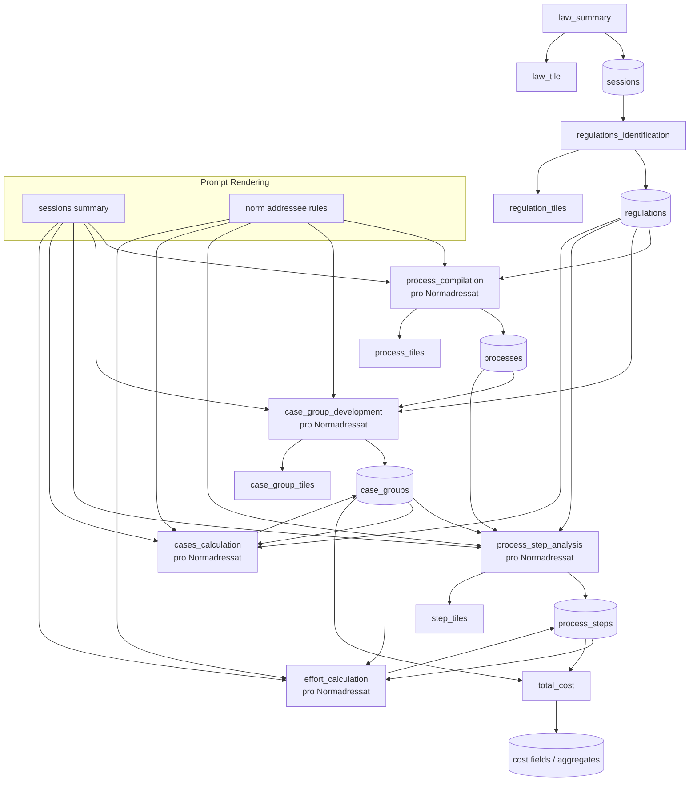

# Prompt-DB-Flow Diagramm

## Lesart

- `law_summary` schreibt die Zusammenfassung in `sessions`
- `regulations_identification` erzeugt `regulations`
- ab `process_compilation` laufen die Schritte getrennt pro Normadressat
- `cases_calculation` berechnet Fallzahlen pro Normadressat
- `effort_calculation` liest `process_steps` + `case_groups`
- `total_cost` ist rein deterministisch und nutzt die bereits gespeicherten Werte
