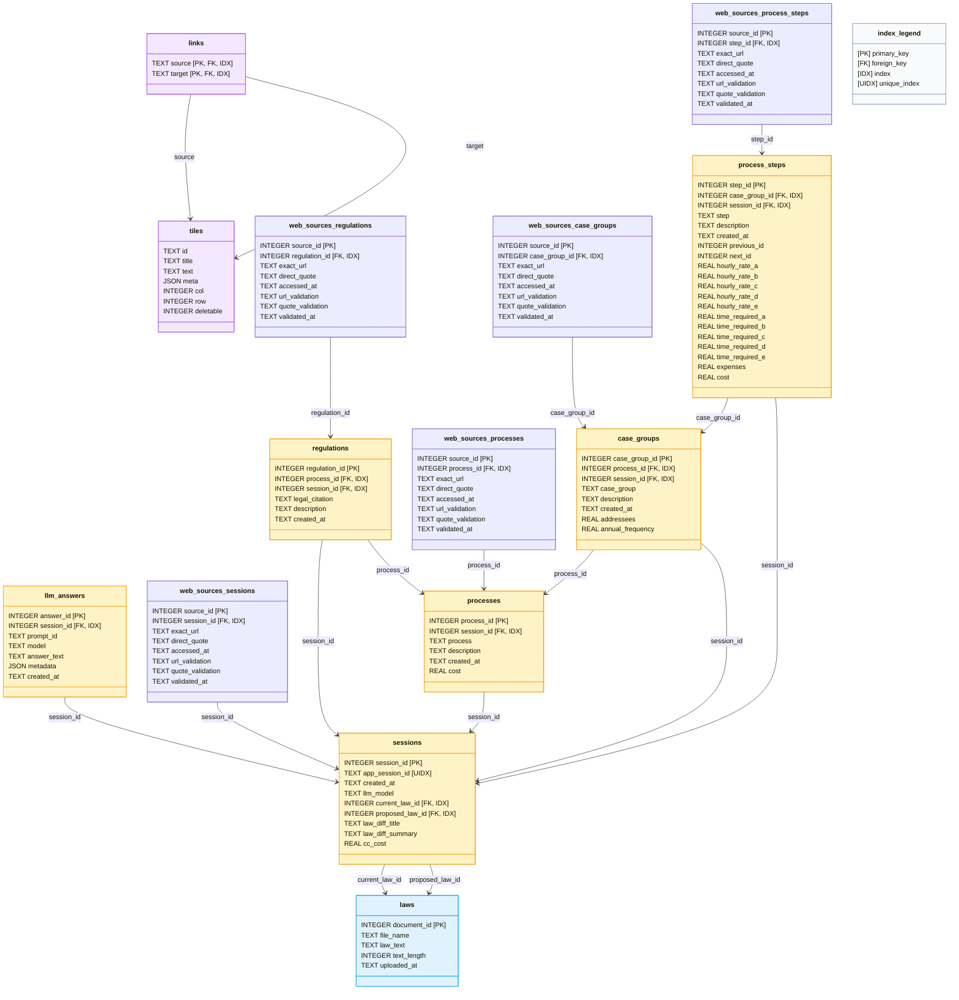

```mermaid
classDiagram
  class tiles {
    TEXT id
    TEXT title
    TEXT text
    JSON meta
    INTEGER col
    INTEGER row
    INTEGER deletable
  }

  class links {
    TEXT source [PK, FK, IDX]
    TEXT target [PK, FK, IDX]
  }

  class sessions {
    INTEGER session_id [PK]
    TEXT app_session_id [UIDX]
    TEXT created_at
    TEXT llm_model
    INTEGER current_law_id [FK, IDX]
    INTEGER proposed_law_id [FK, IDX]
    TEXT law_diff_title
    TEXT law_diff_summary
    REAL cc_cost
  }

  class llm_answers {
    INTEGER answer_id [PK]
    INTEGER session_id [FK, IDX]
    TEXT prompt_id
    TEXT model
    TEXT answer_text
    JSON metadata
    TEXT created_at
  }

  class web_sources_sessions {
    INTEGER source_id [PK]
    INTEGER session_id [FK, IDX]
    TEXT exact_url
    TEXT direct_quote
    TEXT accessed_at
    TEXT url_validation
    TEXT quote_validation
    TEXT validated_at
  }

  class laws {
    INTEGER document_id [PK]
    TEXT file_name
    TEXT law_text
    INTEGER text_length
    TEXT uploaded_at
  }

  class regulations {
    INTEGER regulation_id [PK]
    INTEGER process_id [FK, IDX]
    INTEGER session_id [FK, IDX]
    TEXT legal_citation
    TEXT description
    TEXT created_at
  }

  class web_sources_regulations {
    INTEGER source_id [PK]
    INTEGER regulation_id [FK, IDX]
    TEXT exact_url
    TEXT direct_quote
    TEXT accessed_at
    TEXT url_validation
    TEXT quote_validation
    TEXT validated_at
  }

  class processes {
    INTEGER process_id [PK]
    INTEGER session_id [FK, IDX]
    TEXT process
    TEXT description
    TEXT created_at
    REAL cost
  }

  class web_sources_processes {
    INTEGER source_id [PK]
    INTEGER process_id [FK, IDX]
    TEXT exact_url
    TEXT direct_quote
    TEXT accessed_at
    TEXT url_validation
    TEXT quote_validation
    TEXT validated_at
  }

  class case_groups {
    INTEGER case_group_id [PK]
    INTEGER process_id [FK, IDX]
    INTEGER session_id [FK, IDX]
    TEXT case_group
    TEXT description
    TEXT created_at
    REAL addressees
    REAL annual_frequency
  }

  class web_sources_case_groups {
    INTEGER source_id [PK]
    INTEGER case_group_id [FK, IDX]
    TEXT exact_url
    TEXT direct_quote
    TEXT accessed_at
    TEXT url_validation
    TEXT quote_validation
    TEXT validated_at
  }

  class process_steps {
    INTEGER step_id [PK]
    INTEGER case_group_id [FK, IDX]
    INTEGER session_id [FK, IDX]
    TEXT step
    TEXT description
    TEXT created_at
    INTEGER previous_id
    INTEGER next_id
    REAL hourly_rate_a
    REAL hourly_rate_b
    REAL hourly_rate_c
    REAL hourly_rate_d
    REAL hourly_rate_e
    REAL time_required_a
    REAL time_required_b
    REAL time_required_c
    REAL time_required_d
    REAL time_required_e
    REAL expenses
    REAL cost
  }

  class web_sources_process_steps {
    INTEGER source_id [PK]
    INTEGER step_id [FK, IDX]
    TEXT exact_url
    TEXT direct_quote
    TEXT accessed_at
    TEXT url_validation
    TEXT quote_validation
    TEXT validated_at
  }

  links --> tiles : source
  links --> tiles : target

  sessions --> laws : current_law_id
  sessions --> laws : proposed_law_id

  llm_answers --> sessions : session_id

  web_sources_sessions --> sessions : session_id

  regulations --> sessions : session_id
  regulations --> processes : process_id

  web_sources_regulations --> regulations : regulation_id

  processes --> sessions : session_id

  web_sources_processes --> processes : process_id

  case_groups --> processes : process_id
  case_groups --> sessions : session_id

  web_sources_case_groups --> case_groups : case_group_id

  process_steps --> case_groups : case_group_id
  process_steps --> sessions : session_id

  web_sources_process_steps --> process_steps : step_id

  class index_legend {
    [PK] primary_key
    [FK] foreign_key
    [IDX] index
    [UIDX] unique_index
  }

  style sessions fill:#fef3c7,stroke:#f59e0b
  style regulations fill:#fef3c7,stroke:#f59e0b
  style processes fill:#fef3c7,stroke:#f59e0b
  style case_groups fill:#fef3c7,stroke:#f59e0b
  style process_steps fill:#fef3c7,stroke:#f59e0b
  style llm_answers fill:#fef3c7,stroke:#f59e0b
  style laws fill:#e0f2fe,stroke:#0ea5e9
  style tiles fill:#f3e8ff,stroke:#a855f7
  style links fill:#f3e8ff,stroke:#a855f7
  style index_legend fill:#f8fafc,stroke:#94a3b8

```
