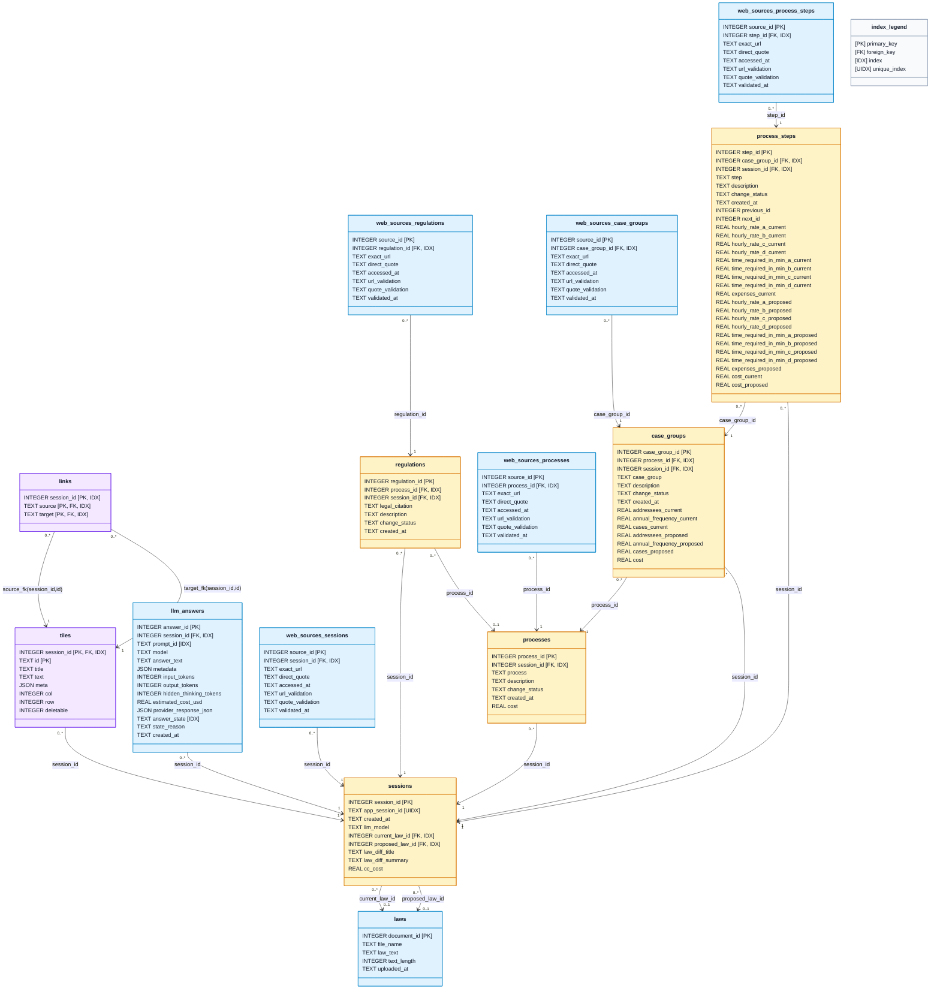

Relationship notes:
- `links` has no direct FK to `sessions`, but both `source` and `target` must resolve to `tiles(session_id, id)`, so links are effectively constrained to a single session.
- `regulations.process_id` is nullable (`0..1`) and uses `ON DELETE SET NULL`.
